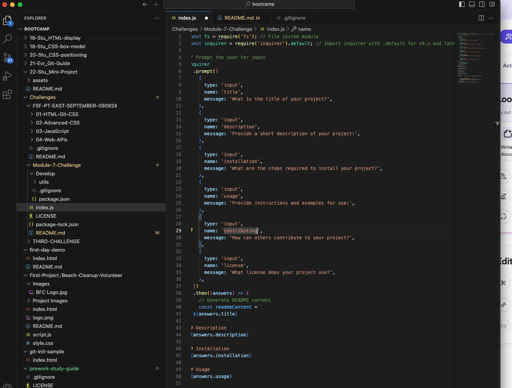
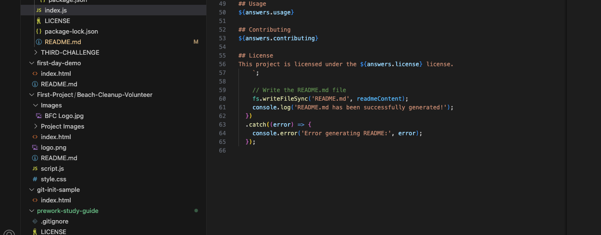

# Module-7-Challenge

## Description
This project was designed to deepen my understanding of web development concepts by creating a fully functional application.

## Installation
1. Clone Repo 2. Navigate to Module-7-Challenge 3. Install Depenedencies with 'npm install' 4. Start with 'npm start'

## Usage
To use the application, open your terminal and navigate to the project directory. Run the application by entering the command `node index.js`. You will be prompted to answer a series of questions about your project, such as its title, description, installation steps, usage instructions, contribution guidelines, and license information. After completing all the prompts, a professional `README.md` file will be automatically generated and saved in the project directory.

## Contributing
To contribute to this project, fork the repository by clicking the "Fork" button on GitHub, then clone your forked repository to your local machine using `git clone https://github.com/validai/Module-7-Challenge.git`. Create a new branch for your feature or fix it with `git checkout -b feature/YourFeatureName`, then make your changes, and commit them using a message like `git commit -m "Add detailed description of your changes"`. Then push your branch to your forked repository using `git push origin feature/YourFeatureName`, then submit a pull request to the original repository with details about your changes and why you think they should be merged. Contributions and feedback are always welcome! Please follow the project's coding standards and guidelines. Thanks for contributing!

## License
This project is licensed under the MIT license.

## Walkthrough Video

Click the link below to view a walkthrough of the application:

[Watch the Walkthrough Video](https://www.loom.com/share/ccf9acab8a1f4f72aa40db25a8993473?sid=a95b38d6-8d6b-4339-b6e7-8bb750fc7922)

## Screenshots

Here are screenshots demonstrating the application:

### Screenshot 1: Application Prompt

### Screenshot 2: Generated README

